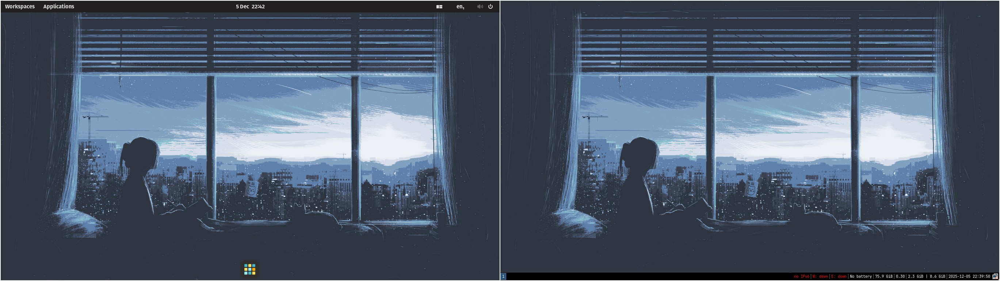

[](https://github.com/SantosVilanculos/dotfiles/blob/main/LICENSE)



```sh
stow -t $HOME -Rv ./
```

```sh
stow -t $HOME -Dv ./
```

---

```sh
sudo add-apt-repository -y ppa:git-core/ppa
```

```sh
sudo add-apt-repository -y ppa:ondrej/php
```

```sh
sudo add-apt-repository -y ppa:ondrej/nginx
```

```sh
sudo add-apt-repository ppa:zhangsongcui3371/fastfetch
```

```sh
/usr/lib/apt/apt-helper download-file https://debian.sur5r.net/i3/pool/main/s/sur5r-keyring/sur5r-keyring_2025.12.14_all.deb keyring.deb SHA256:2c816fbd12ea4d84811818aed0ce3a5da589be1afa30833eb32abc1e4fe6349e
sudo apt install ./keyring.deb
echo "deb [signed-by=/usr/share/keyrings/sur5r-keyring.gpg] http://debian.sur5r.net/i3/ $(grep '^VERSION_CODENAME=' /etc/os-release | cut -f2 -d=) universe" | sudo tee /etc/apt/sources.list.d/sur5r-i3.list
```

---

```sh
apt-mark showmanual > apt.txt
code --list-extensions > code.txt
composer global show --name-only --direct > composer.txt
flatpak list --user --app --columns=application > flatpak.txt
```
